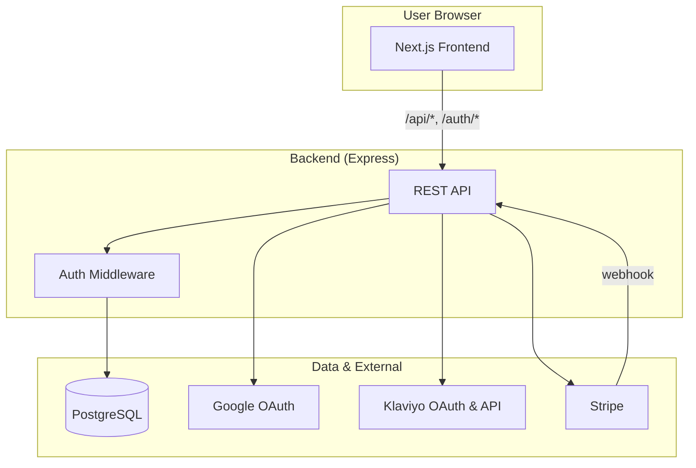
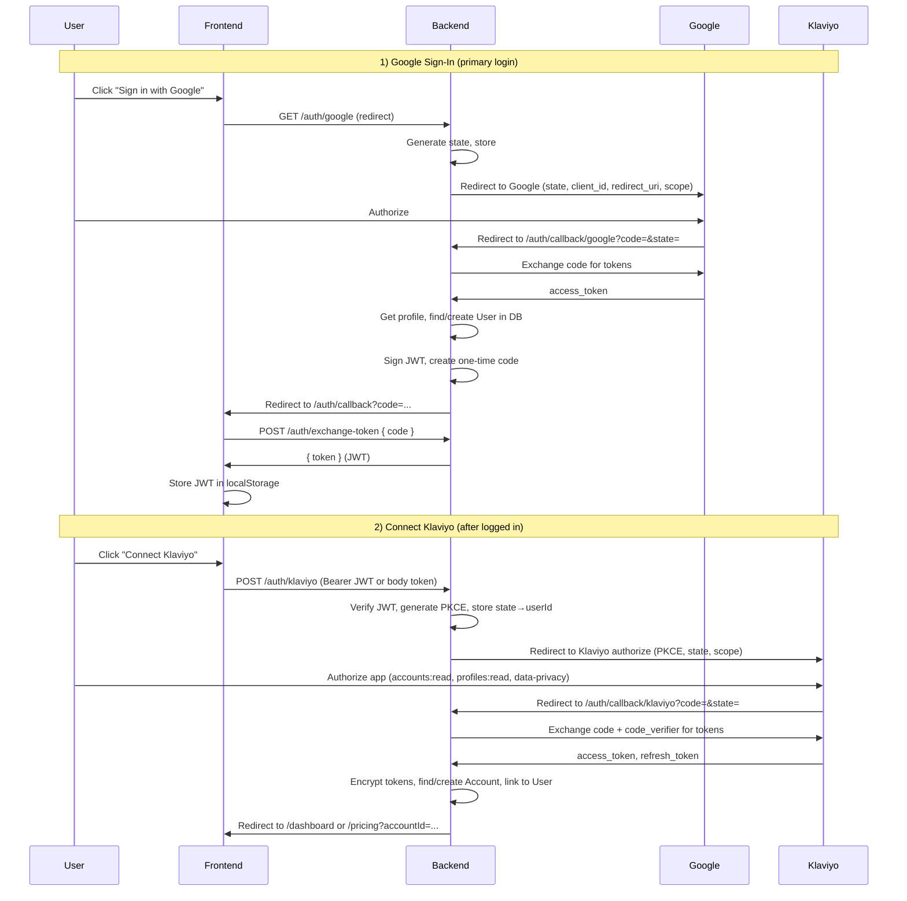
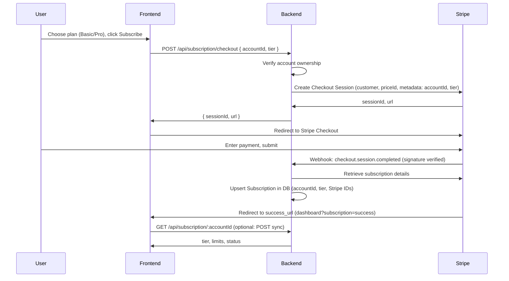

# Spam Profile Cleaner – Architecture & Data Flow

This document describes the system architecture and step-by-step data flows for the Klaviyo Spam Profile Cleaner app, for use in app store submission and developer reference.

---

## 1. High-Level Architecture

```
┌─────────────────────────────────────────────────────────────────────────────────┐
│                                    USER BROWSER                                   │
│  ┌─────────────────────────────────────────────────────────────────────────────┐ │
│  │  Next.js Frontend (React)                                                    │ │
│  │  • Pages: / (landing), /dashboard, /pricing, /subscription, /auth/callback   │ │
│  │  • Rewrites: /api/* and /auth/* → Backend                                    │ │
│  │  • Stores: JWT in localStorage; sends Bearer token on API requests           │ │
│  └─────────────────────────────────────────────────────────────────────────────┘ │
└─────────────────────────────────────────────────────────────────────────────────┘
                    │                    │                    │
                    │ HTTPS              │ HTTPS              │ HTTPS
                    ▼                    ▼                    ▼
┌───────────────────┴───────────────────┴───────────────────┴───────────────────┐
│                        Express Backend (Node.js)                                │
│  • Auth: Google OAuth, JWT, Klaviyo OAuth (PKCE)                               │
│  • API: /api/me, /api/rules, /api/scan, /api/schedule, /api/subscription, etc.   │
│  • Webhooks: Stripe (subscription), Klaviyo uninstall (optional)                │
│  • Cron: /api/schedule/run (API key protected)                                  │
└─────────────────────────────────────────────────────────────────────────────────┘
        │                    │                    │                    │
        │                    │                    │                    │
        ▼                    ▼                    ▼                    ▼
┌──────────────┐    ┌──────────────┐    ┌──────────────┐    ┌──────────────────┐
│  PostgreSQL  │    │   Google     │    │   Klaviyo    │    │     Stripe       │
│  (Supabase)  │    │   OAuth      │    │   OAuth &    │    │  (Checkout &     │
│  • Users     │    │   (Sign-in)  │    │   API        │    │   Webhooks)      │
│  • Accounts  │    │              │    │  • Profiles  │    │                  │
│  • Rules     │    │              │    │  • Data      │    │                  │
│  • Logs      │    │              │    │    Privacy   │    │                  │
│  • Subs      │    │              │    │    (delete)  │    │                  │
└──────────────┘    └──────────────┘    └──────────────┘    └──────────────────┘
```

---

## 2. Mermaid Diagrams (for rendering)

### 2.1 System context



### 2.2 Authentication flows



### 2.3 Core app data flow (rules → scan → delete)

```mermaid
flowchart LR
    subgraph Setup["Setup"]
        A[User creates rules] --> B[Rules stored in DB per Account]
    end

    subgraph Preview["Preview"]
        C[GET /api/scan/:accountId/preview] --> D[Load rules from DB]
        D --> E[Klaviyo API: list profiles]
        E --> F[Match emails to rules]
        F --> G[Return matches to frontend]
    end

    subgraph Execute["Execute"]
        H[POST /api/scan/:accountId/execute] --> I[Get matches as above]
        I --> J[Klaviyo Data Privacy API: deletion jobs]
        J --> K[Log deletions in DB]
    end

    B --> C
    G --> H
```



### 2.4 Subscription flow



---

## 3. Step-by-Step Data Flow (Narrative)

### 3.1 User sign-in (Google OAuth)

1. User clicks **Sign in with Google** on the frontend.
2. Frontend redirects to backend **GET /auth/google**.
3. Backend generates a cryptographically random **state**, stores it in memory, and redirects the browser to **Google’s OAuth authorize URL** (client_id, redirect_uri, scope openid email profile, state).
4. User signs in and consents on Google; Google redirects to **GET /auth/callback/google?code=...&state=...**.
5. Backend validates **state**, exchanges **code** for tokens with Google, fetches user profile, then **finds or creates a User** in PostgreSQL (by googleId).
6. Backend creates a **JWT** (userId, email) and a short-lived **one-time code**, stores code→token in memory, and redirects to frontend **/auth/callback?code=...** (JWT never in URL).
7. Frontend **POST /auth/exchange-token { code }**; backend returns **{ token }** (JWT).
8. Frontend stores the JWT in **localStorage** and sends it as **Authorization: Bearer &lt;token&gt;** on subsequent API requests.

### 3.2 Connect Klaviyo account (Klaviyo OAuth)

1. User is logged in (JWT present). Clicks **Connect Klaviyo** (or equivalent).
2. Frontend sends **POST /auth/klaviyo** with JWT (in body for form POST, or **GET /auth/klaviyo** with Bearer header).
3. Backend verifies JWT, generates **PKCE** (code_verifier, code_challenge), generates **state**, stores state→code_verifier and state→userId in memory, and redirects to **Klaviyo’s OAuth authorize URL** (client_id, redirect_uri, scope: accounts:read profiles:read data-privacy:read data-privacy:write, state, code_challenge, code_challenge_method S256).
4. User authorizes the app in Klaviyo; Klaviyo redirects to **GET /auth/callback/klaviyo?code=...&state=...**.
5. Backend validates **state**, retrieves code_verifier, exchanges **code** with Klaviyo for **access_token** and **refresh_token** (server-to-server to a.klaviyo.com).
6. Backend fetches **account info** from Klaviyo API, **encrypts** access and refresh tokens (APP_SECRET), then **finds or creates an Account** in PostgreSQL (by klaviyoAccountId), sets **userId** to the current user, and stores encrypted tokens and expiry.
7. Backend redirects the browser to frontend **/dashboard?accountId=...** or **/pricing?accountId=...** (e.g. if no subscription yet).

### 3.3 Session and authorization

- **Every API request** (except webhooks and cron) is sent with **Authorization: Bearer &lt;JWT&gt;** (frontend adds it via axios interceptor).
- Backend **auth middleware** parses the JWT, loads the **User** from the database (by payload.userId), and attaches **userId** and **user** to the request.
- **Account-scoped routes** (e.g. /api/rules/:accountId, /api/scan/:accountId/preview) use **requireAccountOwnership**: backend checks that the **Account** with that accountId has **userId** equal to the request’s **userId**. Users can only access their own account’s data.

### 3.4 Rules

- **List:** **GET /api/rules/:accountId** (auth + ownership) → returns cleanup rules for that account from DB.
- **Create:** **POST /api/rules/:accountId** (auth + ownership) with body **{ type, pattern }** → subscription limit checked → rule created in DB for that account.
- **Delete:** **DELETE /api/rules/:ruleId** (auth) → backend loads rule, verifies rule’s account belongs to req.userId → deletes rule from DB.

### 3.5 Scan (preview and execute)

- **Preview:** **GET /api/scan/:accountId/preview** (auth + ownership). Backend loads account’s rules from DB, gets a valid Klaviyo **access token** (refreshing if needed), calls **Klaviyo Profiles API** to list profiles (with email), matches each profile email to the rules, and returns **{ matches, count }** (no deletions).
- **Execute:** **POST /api/scan/:accountId/execute** (auth + ownership), optional body **{ profileIds }**. Backend recomputes matches as in preview; if **profileIds** is provided, only those that are in the match list are deleted (so users cannot delete arbitrary profiles). For each profile to delete, backend calls **Klaviyo Data Privacy API** (data-privacy-deletion-jobs) to request deletion. Backend logs each deletion in **DeletionLog** in DB. Subscription limits (e.g. max profiles per run for free tier) are enforced.

### 3.6 Scheduled cleanup

- **Config:** **GET /api/schedule/:accountId** and **POST /api/schedule/:accountId** (auth + ownership) read/update **ScheduledCleanup** in DB (e.g. isEnabled, frequencyDays, nextRunAt). Scheduling may be restricted to Pro tier.
- **Manual run:** **POST /api/schedule/:accountId/run** (auth + ownership) triggers the same cleanup logic as the cron for that account.
- **Cron:** An external scheduler (e.g. Vercel Cron) calls **POST /api/schedule/run** with **X-API-Key** (or Authorization) set to **CRON_API_KEY**. Backend loads all accounts with scheduled cleanup enabled and nextRunAt ≤ now, runs the scan+delete for each, and updates nextRunAt and **CleanupRun** records.

### 3.7 Subscription (Stripe)

- **Checkout:** **POST /api/subscription/checkout** (auth) with **{ accountId, tier }**. Backend verifies account ownership, gets or creates a Stripe **Customer**, creates a Stripe **Checkout Session** in **subscription** mode with the appropriate **price** (STRIPE_BASIC_PRICE_ID or STRIPE_PRO_PRICE_ID) and **metadata** (accountId, tier). Returns **{ sessionId, url }**; frontend redirects user to Stripe Checkout.
- **Webhook:** **POST /api/subscription/webhook** (no auth; verified with **STRIPE_WEBHOOK_SECRET** and raw body). On **checkout.session.completed**, backend reads **accountId** and **tier** from session metadata, retrieves the Stripe **Subscription**, and **upserts** a **Subscription** row in DB (accountId, tier, status, Stripe IDs, period dates). On **customer.subscription.updated** / **deleted**, backend updates or cancels the corresponding Subscription row.
- **Sync:** **POST /api/subscription/:accountId/sync** (auth + ownership) can be used to align DB with Stripe when webhooks were missed (e.g. in dev).
- **Cancel / change tier / reactivate:** Account-scoped endpoints call Stripe API and update the **Subscription** row in DB.

### 3.8 Disconnect and uninstall

- **Disconnect (in-app):** **POST /api/disconnect/:accountId** (auth + ownership). Backend revokes the Klaviyo **refresh_token** via Klaviyo **/oauth/revoke**, then deletes the account’s **ScheduledCleanup**, **CleanupRun**, **CleanupRule**, **DeletionLog**, **Subscription**, and **Account** in DB. User remains logged in (Google); they can connect another Klaviyo account later.
- **Klaviyo uninstall webhook (optional):** **POST /webhooks/klaviyo/uninstall/:webhookSecret** (if KLAVIYO_WEBHOOK_SECRET is set). Used if Klaviyo supports notifying the app when a user removes the integration; backend finds the account by payload and performs the same cleanup as disconnect. (Klaviyo’s public OAuth app settings do not expose an uninstall URL; this is for future or partner use.)

---

## 4. Data Stored (summary)

| Where        | What |
|-------------|------|
| **PostgreSQL** | **User** (id, googleId, email, name, picture). **Account** (id, userId, klaviyoAccountId, encrypted accessToken/refreshToken, tokenExpiresAt). **CleanupRule**, **DeletionLog**, **ScheduledCleanup**, **CleanupRun**, **Subscription** (linked to Account). |
| **Frontend**   | JWT in **localStorage**; accountId in **localStorage** / URL as needed. |
| **Backend**    | In-memory only: Google **state**; one-time **login codes** (short-lived); Klaviyo **state→code_verifier** and **state→userId** (for the duration of the OAuth flow). No long-term secrets in memory. |
| **Klaviyo**    | Profiles and deletion requests via API; no data stored by Klaviyo for this app beyond what they hold for the linked account. |
| **Stripe**     | Customer, subscription, and payment data; subscription status is mirrored into our DB via webhooks. |
| **Google**     | Used only for sign-in; we store googleId and profile fields in our DB. |

---

## 5. Security (summary)

- **Google:** State parameter validated on callback; JWT never in URL (one-time code exchange).
- **Klaviyo:** PKCE; state tied to userId; tokens encrypted at rest (APP_SECRET); least-permissive scopes (accounts:read, profiles:read, data-privacy:read, data-privacy:write).
- **API:** All account-scoped actions require JWT and **requireAccountOwnership** (Account.userId === req.userId).
- **Stripe:** Webhook signature verification (raw body + STRIPE_WEBHOOK_SECRET).
- **Cron:** Protected by CRON_API_KEY.

---

*Document version: 1.0. For Klaviyo app store submission and internal reference.*
